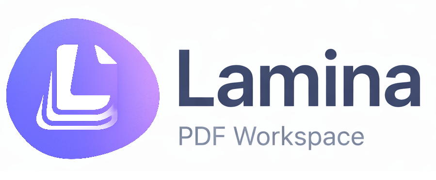

# Lamina

A modern, AI-powered PDF editor and document management system built with a separated **backend/frontend architecture** using **MVC micromodular design**.



## 🚀 Quick Start

```bash
# Install dependencies
npm install

# Start both backend and frontend
npm run dev
```

- **Backend API**: http://localhost:3001
- **Frontend App**: http://localhost:5173

## 📁 Project Structure

```
lamina/
├── backend/                        # Node.js Express API
│   ├── src/
│   │   ├── app.ts                  # Express app entry
│   │   ├── config/                 # Environment & Supabase config
│   │   ├── middleware/             # Auth, error, validation
│   │   └── modules/                # MVC modules
│   │       ├── auth/               # Authentication
│   │       ├── documents/          # Document CRUD
│   │       ├── annotations/        # PDF annotations
│   │       ├── storage/            # File storage
│   │       ├── ai/                 # AI features (Gemini 2.0 Flash)
│   │       └── convert/            # File conversion
│   └── .env.example
│
├── frontend/                       # React + Vite App
│   ├── src/
│   │   ├── api/                    # API client layer
│   │   ├── components/
│   │   │   ├── document/           # Document list & thumbnails
│   │   │   ├── editor/             # PDF editor components
│   │   │   │   ├── canvas/         # Fabric.js canvas & layers
│   │   │   │   └── ...             # Annotations, toolbar, etc.
│   │   │   ├── layout/             # TopBar, Sidebars, Toolbar
│   │   │   ├── ui/                 # shadcn/ui components
│   │   │   └── upload/             # File upload zone
│   │   ├── hooks/                  # React hooks (including hydration engine)
│   │   ├── pages/                  # Page components
│   │   └── lib/                    # Utilities
│   └── .env.example
│
├── shared/                         # Shared TypeScript types
│   └── src/
│       ├── models.ts               # Data models
│       └── api.ts                  # API types
│
└── docs/                           # Documentation
    └── setup/                      # Setup guides
```

## ✨ Features

### Core PDF Editor
- 📄 **PDF Rendering**: High-fidelity PDF.js viewer with zoom and navigation
- 🎨 **Multi-Layer Canvas**: Fabric.js-powered drawing canvas with layer management
- ✏️ **Drawing Tools**: Pen, highlighter, shapes (rectangle, circle, line, arrow)
- 📝 **Text & Notes**: Add text blocks, sticky notes, and callouts
- 🖼️ **Image Support**: Insert and manipulate images on PDF pages
- ↩️ **Undo/Redo**: Full history support with keyboard shortcuts
- 💾 **Export**: Save annotations and export modified PDFs

### Document Management
- 🔐 **Authentication**: Google OAuth + Guest mode
- 📤 **File Upload**: Drag & drop with progress tracking
- 🗂️ **Document List**: Grid/List view with search and filtering
- ✏️ **Rename/Delete**: Manage your documents with ease
- 💾 **Cloud Storage**: Supabase storage with Row Level Security

### AI Copilot (Gemini 2.0 Flash)
- 💬 **Chat**: Ask questions about your documents
- 📝 **Summarize**: Generate brief or detailed summaries
- ✍️ **Rewrite**: Transform text in different tones
- ❓ **Questions**: Auto-generate relevant questions
- 🔍 **Context-Aware**: AI understands your PDF content

### UI/UX
- 🎨 **Modern Design**: Clean, pastel-inspired aesthetic
- 📱 **Responsive**: Works on desktop and mobile
- 🌙 **Dark Mode Ready**: Theme support via next-themes
- ⌨️ **Keyboard Shortcuts**: Ctrl+Z, Ctrl+Y, Delete, etc.

## 🛠️ Tech Stack

### Backend
- **Runtime**: Node.js 18+
- **Framework**: Express.js + TypeScript
- **Database**: Supabase (PostgreSQL)
- **AI**: Google Gemini 2.0 Flash API
- **Validation**: Zod
- **Security**: Helmet, CORS, Rate limiting

### Frontend
- **Framework**: React 18 + TypeScript + Vite 7
- **Styling**: Tailwind CSS 3.4 + shadcn/ui
- **State**: TanStack Query (React Query) + Zustand
- **Routing**: React Router v6
- **PDF**: PDF.js + pdf-lib
- **Canvas**: Fabric.js 6.x
- **Icons**: Lucide React

### Shared
- **Types**: TypeScript interfaces shared between BE/FE
- **Package**: @lamina/shared (workspace)

## 🔧 Development Setup

### Prerequisites

- Node.js 18+
- npm
- Supabase account
- Google Cloud Console account (for OAuth)
- Google AI Studio account (for Gemini API)

### Environment Setup

1. **Backend** - Copy `backend/.env.example` to `backend/.env`:
   ```env
   PORT=3001
   NODE_ENV=development
   
   SUPABASE_URL=your_supabase_url
   SUPABASE_SERVICE_KEY=your_service_role_key
   SUPABASE_ANON_KEY=your_anon_key
   
   GEMINI_API_KEY=your_gemini_api_key
   
   JWT_SECRET=your_32_char_secret_key
   ALLOWED_ORIGINS=http://localhost:5173
   ```

2. **Frontend** - Copy `frontend/.env.example` to `frontend/.env`:
   ```env
   VITE_API_URL=http://localhost:3001/api
   VITE_SUPABASE_URL=your_supabase_url
   VITE_SUPABASE_ANON_KEY=your_anon_key
   ```

### Run Development

```bash
# Install all dependencies (runs postinstall to build shared types)
npm install

# Start both backend and frontend
npm run dev

# Or start separately:
npm run dev:backend   # Backend on http://localhost:3001
npm run dev:frontend  # Frontend on http://localhost:5173
```

### Build for Production

```bash
npm run build
```

## 📡 API Endpoints

### Authentication (`/api/auth`)
| Method | Endpoint | Description |
|--------|----------|-------------|
| GET | `/me` | Get current user |
| POST | `/google` | Google OAuth |
| POST | `/anonymous` | Anonymous sign-in |
| POST | `/logout` | Sign out |

### Documents (`/api/documents`)
| Method | Endpoint | Description |
|--------|----------|-------------|
| GET | `/` | List documents (paginated) |
| GET | `/:id` | Get document |
| POST | `/` | Create document |
| PATCH | `/:id` | Update document |
| DELETE | `/:id` | Delete document |

### Annotations (`/api/documents/:id/annotations`)
| Method | Endpoint | Description |
|--------|----------|-------------|
| GET | `/` | Get all annotations |
| POST | `/` | Save annotations |

### Storage (`/api/storage`)
| Method | Endpoint | Description |
|--------|----------|-------------|
| POST | `/upload` | Upload file |

### AI (`/api/ai`)
| Method | Endpoint | Description |
|--------|----------|-------------|
| POST | `/chat` | Chat with document |
| POST | `/summarize` | Summarize document |
| POST | `/rewrite` | Rewrite text |
| POST | `/questions` | Generate questions |

### Convert (`/api/convert`)
| Method | Endpoint | Description |
|--------|----------|-------------|
| POST | `/image` | Image to PDF |

## 🏗️ Architecture

The application follows a clean **MVC micromodular architecture**:

```
┌─────────────────────────────────────────────────────────┐
│                      Frontend                            │
│  React + Vite + TailwindCSS + shadcn/ui + Fabric.js     │
│  API Client Layer → React Query Hooks                    │
└─────────────────────┬───────────────────────────────────┘
                      │ HTTP/REST
┌─────────────────────▼───────────────────────────────────┐
│                      Backend                             │
│  Express.js + TypeScript                                │
│  ├── Middleware (Auth, Validation, Error Handling)      │
│  └── Modules (Auth, Documents, Annotations, Storage,    │
│               AI, Convert)                               │
└─────────────────────┬───────────────────────────────────┘
                      │
┌─────────────────────▼───────────────────────────────────┐
│                    Supabase                              │
│  PostgreSQL + Auth + Storage + RLS                      │
└─────────────────────────────────────────────────────────┘
```

Each backend module follows the MVC pattern:
- `types.ts` - Validation schemas & types
- `service.ts` - Business logic
- `controller.ts` - HTTP handlers
- `routes.ts` - Express routes

## 📚 Documentation

- **[Setup Checklist](docs/setup/SETUP-CHECKLIST.md)** - Complete setup
- **[Database Migration](docs/setup/DATABASE-MIGRATION.md)** - DB setup
- **[Google Auth Setup](docs/setup/GOOGLE-AUTH-SETUP.md)** - OAuth config
- **[Supabase Storage](docs/setup/SUPABASE-STORAGE-SETUP.md)** - Storage setup

## 📄 License

All rights reserved - 2025

---

**Last Updated**: December 28, 2025  
**Version**: 2.1.0 (Canvas Editor + AI Copilot)  
**Status**: Active Development 🚀
