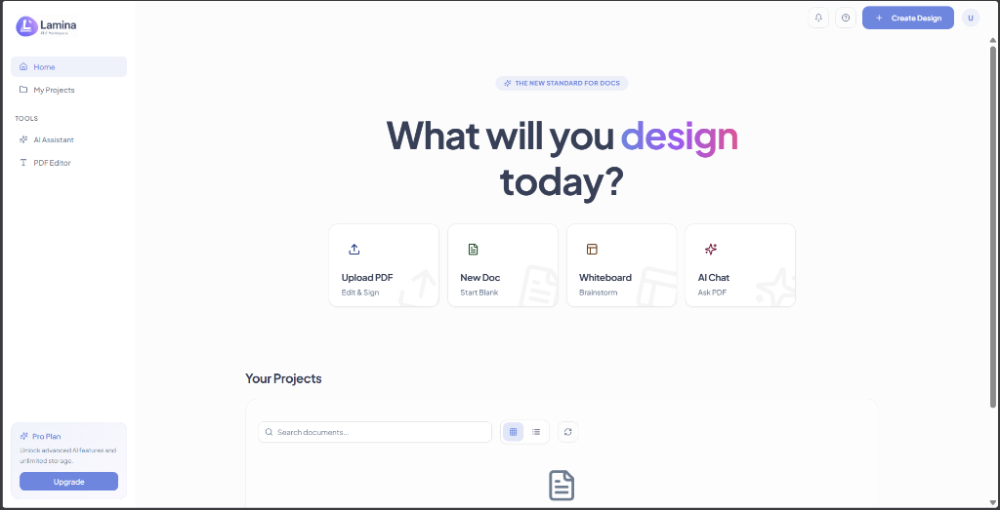
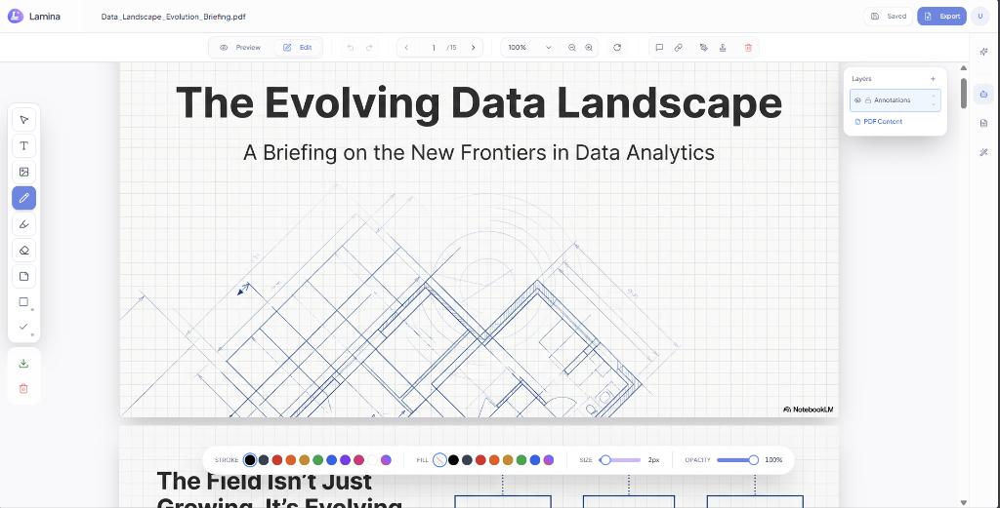

# Lamina PDF Workspace

**A modern, AI-powered PDF editor and document management system.**

🔗 **Live Demo**: [https://lamina-v1.vercel.app/](https://lamina-v1.vercel.app/)


---

## 📖 About

Lamina is a full-featured PDF editor built for the web. It combines powerful annotation tools with AI assistance to help you work smarter with documents. Upload any PDF, annotate it with drawings, text, shapes, and images, then export your work—all from your browser.

---

## ✨ Features

### 📄 PDF Editing
- High-fidelity PDF rendering with zoom and navigation
- Multi-layer canvas powered by Fabric.js
- Drawing tools: pen, highlighter, shapes (rectangle, circle, line, arrow)
- Text blocks, sticky notes, and callouts
- Image insertion and manipulation
- Undo/Redo with keyboard shortcuts
- Export annotated PDFs

### 🗂️ Document Management
- Google OAuth and Guest mode authentication
- Drag-and-drop file upload with progress tracking
- Grid/List view with search and filtering
- Rename and delete documents
- Secure cloud storage via Supabase with Row Level Security

### 🤖 AI Copilot (Gemini 2.0 Flash)
- Chat with your documents
- Generate summaries (brief or detailed)
- Rewrite text in different tones
- Auto-generate relevant questions
- Context-aware assistance that understands your PDF content

### 🎨 UI/UX
- Modern pastel-inspired design
- Responsive layout for desktop and mobile
- Dark mode support via next-themes
- Keyboard shortcuts (Ctrl+Z, Ctrl+Y, Delete, etc.)

---

## 📸 Screenshots



*Dashboard – Upload PDFs, create new documents, or start a whiteboard.*



*Editor – Annotate PDFs with drawing tools, text, shapes, and images.*

---

## 🏗️ Architecture

```
┌───────────────────────────────────────────┐
│              Frontend                     │
│   React 18 + Vite + Tailwind + shadcn/ui  │
│   Fabric.js canvas · PDF.js viewer        │
│   TanStack Query + Zustand state          │
└─────────────────┬─────────────────────────┘
                  │ /api/* requests
                  ▼
┌───────────────────────────────────────────┐
│         Vercel Serverless Functions       │
│   TypeScript handlers in /api folder      │
│   Auth · Documents · Annotations          │
│   Storage · AI (Gemini) · Convert         │
└─────────────────┬─────────────────────────┘
                  │
                  ▼
┌───────────────────────────────────────────┐
│              Supabase                     │
│   PostgreSQL database                     │
│   Authentication (Google OAuth)           │
│   File storage with Row Level Security    │
└───────────────────────────────────────────┘
```

### How It Works

1. **Upload** – Users upload PDFs which are stored in Supabase Storage.
2. **Render** – PDF.js renders the document on a canvas; Fabric.js overlays an annotation layer.
3. **Annotate** – Users draw, add text, insert images, and create shapes on the canvas.
4. **AI Assist** – The Gemini API provides chat, summarization, rewriting, and question generation.
5. **Save & Export** – Annotations are saved to the database; users can export the final PDF with embedded annotations.

---

## 🛠️ Tech Stack

| Layer | Technologies |
|-------|--------------|
| **Frontend** | React 18, TypeScript, Vite, Tailwind CSS, shadcn/ui, Fabric.js, PDF.js, pdf-lib, Zustand, TanStack Query, React Router v6 |
| **Backend** | Vercel Serverless Functions (TypeScript), Zod validation |
| **Database** | Supabase (PostgreSQL) with Row Level Security |
| **AI** | Google Gemini 2.0 Flash API |
| **Auth** | Supabase Auth (Google OAuth + Anonymous) |
| **Storage** | Supabase Storage |

---

## 📄 License

All rights reserved © 2025

---

**Version**: 2.1.0  
**Status**: Active Development 🚀
